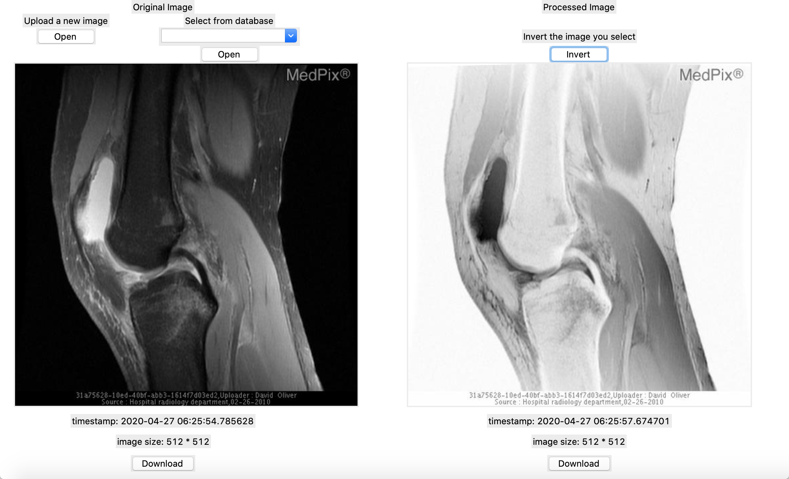

# BME547 Final Project
Author: Tong Fu

Date Last Modified: 04/27/2020

## Software Liscense:
```
MIT License

Copyright (c) [2020] [Tong Fu]

Permission is hereby granted, free of charge, to any person obtaining a copy
of this software and associated documentation files (the "Software"), to deal
in the Software without restriction, including without limitation the rights
to use, copy, modify, merge, publish, distribute, sublicense, and/or sell
copies of the Software, and to permit persons to whom the Software is
furnished to do so, subject to the following conditions:

The above copyright notice and this permission notice shall be included in all
copies or substantial portions of the Software.

THE SOFTWARE IS PROVIDED "AS IS", WITHOUT WARRANTY OF ANY KIND, EXPRESS OR
IMPLIED, INCLUDING BUT NOT LIMITED TO THE WARRANTIES OF MERCHANTABILITY,
FITNESS FOR A PARTICULAR PURPOSE AND NONINFRINGEMENT. IN NO EVENT SHALL THE
AUTHORS OR COPYRIGHT HOLDERS BE LIABLE FOR ANY CLAIM, DAMAGES OR OTHER
LIABILITY, WHETHER IN AN ACTION OF CONTRACT, TORT OR OTHERWISE, ARISING FROM,
OUT OF OR IN CONNECTION WITH THE SOFTWARE OR THE USE OR OTHER DEALINGS IN THE
SOFTWARE.
```

## Graphical User Interface


## Overview

This project developed a image processor that will allows user to choose a photo from local computer **or** select a photo from database and invert the image. It also displays the timestamp that the user uploaded or selected the photo **and** the image dimensions (width * height). Moreover, the user can also download an image in database or an image processed.

More information could be found at:

https://github.com/dward2/BME547/blob/master/Assignments/final_image_processor.md

Some codes for handling image processing are taken from:

https://github.com/dward2/BME547/blob/master/Resources/image_toolbox.md#testing-toolbox-code

The realeased .zip file will include:

1) *cloud_server.py*: the main server
2) *test_cloud_server.py*: a unit test program to perform pytest
3) *gui_client.py*: the GUI client to be interacted with
4) *requirements.txt*: required environment for this project
5) *test_image_1.jpg* and *test_image_2.jpg*: test images for pytest.
6) *background.jpg*: the background photo when the GUI client is first initialized.
7) *images*: a folder containing sample images.
8) *video demonstration.mp4*: video demonstration of the project


## How to run the program

- To run the program, download the latest version released and open the gui_client.py file in one of the Python IDEs (e.g. PyCharm) OR clone the repository and open it with command-line tools (eg. Git Bash for Windows or Terminal for macOS).

- Download the requirements.txt file, and run the following code to install the environment required for the project.

<pre><code>pip install -r requirements.txt
</code></pre>

- If you are using PyCharm, it is possible that sometimes you will have to manually install the packages in settings. Required packages are listed in the requirements.txt file.

- **For testing purpose**

1) If you want to test the code, have two bash windows opened at the same time. Use one for the server and one for the client.
2) In the server window, run the following code:

<pre><code>python cloud_server.py
</code></pre>

   In the client window, run the following code:

<pre><code>python gui_client.py
</code></pre>

- The local host in the client code is http://127.0.0.1:5000/


## Program Interpretation

There is a video demonstration for how to use the program.

### Routes

1) `POST /addOriginal`: post original image information to database.

2) `POST /addInverted`: post inverted image info to database.

3) `GET /getOriginalNames`:  get a list of all the names of original images in database.

4) `GET /getInvertedNames`: get a list of all the names of inverted images in database.

5) `GET /getOriginalB64`: get a list containing base64 strings of all original images in database.

6) `GET /getInvertedB64`: get a list containing base64 strings of all inverted images in database.

### Functions

* The GUI interface is able to:

  + choose and display an image (original or processed) from the server.

  + show two images from the server side-by-side.

  + download an image (original or processed) from the server and save it on the local computer. 

  + display useful metadata of displayed images (timestamp & size)
 
* The cloud-based server is able to:
 
  + accept images for uploading and storage and information associated with the image.

  + invert any photo that's stored in local computer or in database.

  + provide a list of available images that are stored in database to the client.

  + provide for the downloading of an image (for both images uploaded or select from the database)
  
  + store only unique images: if you have uploaded the same image that has already been stored in the database, the database will not store it again.
 
### Restrictions

Although the program is pretty robust, it still has some restrictions and space for improvement.

1) If you want to see a list of the images in database **including the photo you just uploaded**, you might have to quit the program and restart again so that the dropdown menu can update.

2) The interface is not fancy, but it's simple to use and user friendly.

3) The widget will automatically and **proportionally** resized in a 500 * 500 canvas, so sometimes it will look like it is "shrinked" or "expanded". **However**, the size information will always give the correct width * height information of the original image.

## Travis Status Badge

[](https://travis-ci.com/BME547-Spring2020/final-project-tongfu98)
